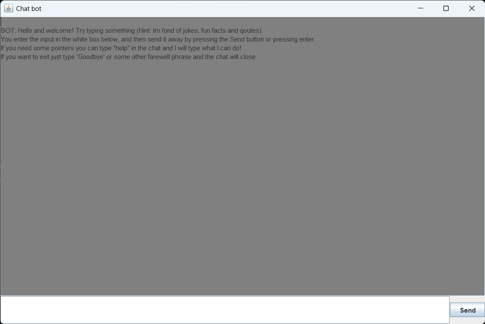
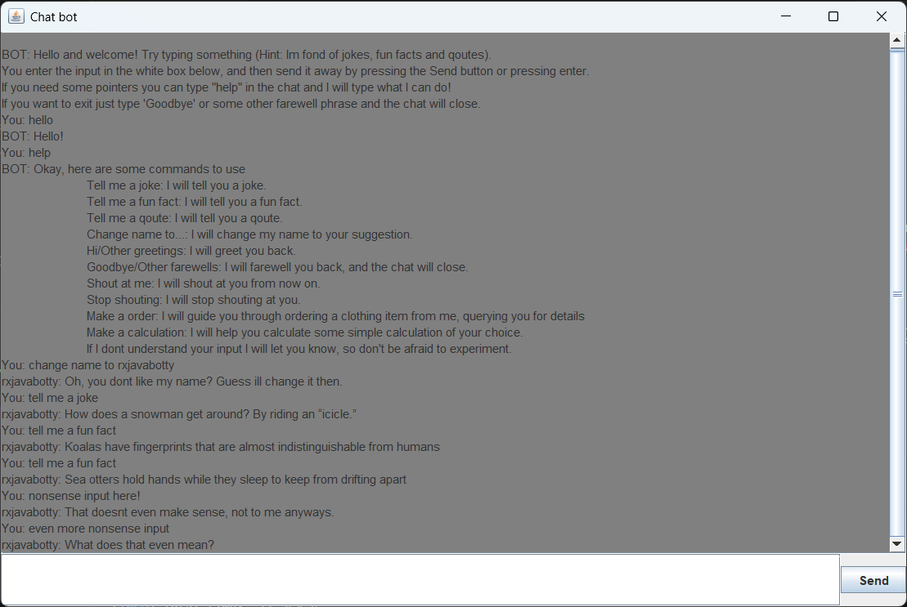
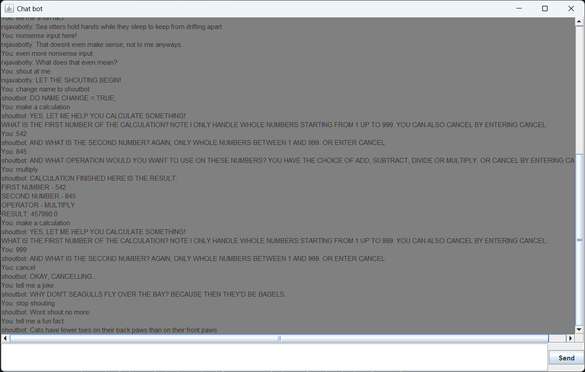

# Screenshots

# Final Project

## Environment & Tools

The practical work of this project was performed on a HP-laptop with Windows 11. Java 23 2024-09-17 was used as the programming language with VSCode 1.96.2 as the IDE, Apache Maven 3.9.9 was used as the build system, git version 2.46.0.windows.1 was used for version control.

## Purpose

The purpose of this project is to develop a simple chat bot using a declarative approach to writing code. More specifically the code should adhere to reactive and functional programming principles. To achieve this the the use of streams will be utilised for the functional code and for the reactive code RxJava will be utilised.

This solution aims for the C-grade and below are 12 requirements that each should be fulfilled, the requirements are taken and somewhat rewritten from the project description.  

List of the concrete goals for this project:

- The Observable & Observer pattern should be used to handle the flow of the input and responses in the program.

- RxJava operators should be used and chained to manipulate the data in the program.

- Some combining of Observables should be used in the program to merge two Observables together.

- Some form of multicasting should be used in the program, aswell as subjects.

- Schedulers should be used as to not block the main thread.

- Buffering and throttling should be used in the program to handle, group or manage fast inputs. Switching should also be present with the `switchMap` operator.

- The program should have some use of flowable with appropriate backpressure strategy.

- The program should adhere to the functional programming paradigm in where statelessness and immutability are main factors of this. The use of streams from the streams api should also be present.

- The program should handle errors correctly using the tools available from RxJava.

- The chat bot should be easy to use with instructions present for the user.

- The project needs to adhere to Mavens inherent structure and created files needs to be placed in appropriate subpackages. Created modules/classes also needs proper documentation, this also applies to packages.

- The project should not be overly simplified and the work done should mirror the time remaining in the course.

## Procedures

Note: *Since this project follows functional programming principles classes and other entities will be refered as modules and methods will be refered to as functions. Even though this does not conform to the normal java terminology it is more in line with functional programming terminology and makes sense in this context. This will be the case in the discussion aswell*'

At first a rough plan for the project was thought up of what modules/parts was needed to make a functional chatbot. It was quite quickly decided that the crucial parts were to be input handler, output handler, response generator and a engine/coordinator. Additional features were decided to be worked on after these crucial parts have been implemented and firmer grasp on the time requirements had been established.

First the input and output were implemented. Both of these use the CLI to get and print the data. The input is a method that returns a observable where each emission is an read line from a scanner, later this was changed to a flowable to adhere to the requirements of the project. The output just uses print line function to print the passed in response, later when chat context was added this was also passed in to format the output.

Next the `JSONUtil` module was created which handles access to the database. A feature where users could be created, deleted and updated was worked on and later scrapped to keep in line with requirements on statelessness and side effects. This class still handles the feature to get a response based on a keyword. It finds a response based on the seed passed in so the response can be different each time.

Next on the logic for response generation was implemented. At this point the `Constants` module was also created to hold regular expressions that could be matched to input, this is stored as a map so a keyword is then returned that is used in the `JSONUtil` module. The `generateResponse` returns a `Maybe` based on if a response is returned or not, earlier implementations returned an empty `Maybe` if no response was found but later on it now returns a line for this aswell so it is only empty if a error occured which is handled downstream in the engine. This module also has a private function using streams to check the input for regex matches and then returning those keywords, this function is used in a map in `generateResponse`.

Next a first iteration of the chat engine module was implemented which creates a `Subject` that handles input as sort of a bus, right now it only handles responses. The engine takes in output and input as `Supplier` and `Consumer` functions which are functional interfaces available in the `java.util.function` package. The input is also published so that in later implementations the action handler can also observe those emissions.

Next on was to crete the action handler, which will handle the shout/caps functionality and the name change of the bot. The action handler has a response generator wich is quite similar to `generateResponse` except that this generates responses for if an action was requested by the user. If a name change is requested it sends this requested name as a keyword and handled in the chat context observable, meaning if the chat context observable encounters a non keyword phrase it knows it is a name and changes it. The above mentioned chat context was also implemented at this time which emits a chat context record and emits a new one if a change is requested by the user. The change can be either a name change of the bot or a request for the bot to stop/start shout/use caps.

Next a small tweak was added so that the bot buffers input a bit. This is only so the bot does not respons immideatly, but restarts the buffer on each input from the user so called "bursty inputs" and then waits a short time before outputting the response. This is done so the user can type several fast messages and the bot responding to all of them after the user is done typing which feels more natural. The technique to acheve this was suprisingly complex requiring both debouncing and buffering, but the decided approach was found in the RxJava documents here: [Buffer Reactive Docs](https://reactivex.io/documentation/operators/buffer.html) as the last example under RxJava 1.X.

At this point all the main modules were in place and from here on adjustments to these modules were the main focus. First up was to add schedulers to the `Observables`. A mix of `observeOn` and `subscribeOn` was used to achieve the desired result, and the main scheduler was io, which is not suprising since there is a lot of io in the program.

Next, the input observable was remade to a flowable to be in line with the requirements.

Then a response for if the response generation could not find any keywords for either actions or regular responses were added. At that point the response generator adds a no response keyword wich can than in turn be looked up in the json database.

Next the error handling was lighty updated. Some error handling were already present but here it was just made a bit more robust.

The private methods to get regex matches were then made to only use streams to more adhere with functional programming, as previously they used some mutable variables and imperative concepts.

Then, some small refactorings such as renaming things, especially lambda parameters, were done to make the code more readable. The feature of format document present in VSCode was also used so that all files were formatted equally. After this documentation was added to all entitites along with package documentation.

After this a conversation option to have a conversation with state using declarative principles was implemented. These changes where made in the response generator. But first a record was implemented to hold the both the conversation state and the input from the user to keep track of. The `generateResponse` function was altered to use `defer` to see if the bot should respond with a simple response as previous implementation does or instead use the `getStateConversationResponse` to get a response based on the state of the conversation and what the user have previously entered. To keep track of the conversation state a behaviour subject was used so that the latest value could be obtained to see the current state and to also push new state to it when necessary. The conversation using states is for the user to order some clothing product and then choosing the color and size of this with some pre defined options.

`getStateConversationResponse` uses a reactive stream to query the user for the appropriate input based on the conversation state and then validates that input before updating the state and waiting for the next user input. After all the queries are done the result of "order" is shown to the user. During all this time the user can also cancel the order to get back to "regular" conversation with the bot. The chat engine was slightly altered to create this conversation state subject and to pass it through the reactive stream to `generateResponse`.

Next this conversation using state was expanded to also allow the user to enter some simple calculation which the bot then calculates and displays the result. Here just as before it validates the input and the user can choose two numbers between 1 and 999 and some operator of add, subtract, multiply and divide. Then the calculation is done and the result is shown to the user. Just as before the user can cancel this conversation at any time and return.

Next a GUI was implemented using Java swing. The GUI consists of one text area where the chat is displayed, one text area where the user can enter their input and one send button to send the inputted message, the user can also send messaged by pressing the enter key. This view is present in the `ChatBotView` module.

After that GUI window was implemented functions where needed to get the input as a flowable from the input text box and to print any response to the chat window. These are also present in the `ChatBotView` module. The function to get the input flowable also handles the clearing of the input text box and printing what the user wrote to the chat window. These functions are simply passed in to the chat enginge, which has been renamed to `ChatEngine`, since the engine simply takes in the output and input functions.

Then, finally for the coding part a function to exit the program in a controlled manner was added. Since there is already a function for the bot to say goodbye this was used to also terminate when the user says goodbye. This is done through a exit subject that is created in the chat engine that is passed to `generateResponse` and if the user enters goodbye, farewell, bye or bye bye the exit subjects have been subscribed to and the program is then terminated this is done in the `ChatEngine` module in the `initializeEngine` function.

Then the documenation was updated and some refactorings done to improve readability, the use of reactive streams or in other ways refactor the code to a better standard. As before the format document feature of VSCode was also used to format all files correctly.

## Discussion

### Purpose Fulfillment

The use of observable and observer pattern and these functionalities can be found quite extensively in the code, here follows some examples of the achievement of this goal. The user input is recieved from a flowable which is a type of observable, this is done in `Project.java` through either the `ChatBotView` and the function `getGuiInputFlowable` or through the `getCliInputFlowable` in the `CliInput` module for the GUI and CLI implementation respectively. This reactive stream observable is then used in the chat engine where the input is processed and generating output through the `generateResponse` function in the `ResponseGenerator` module. Finally, this observable is subscribed to through the output subject and the response is shown to the user. This ensures the fulfillment of this goal in that the flow of data from the user is handled using the observable/observer pattern and to process the data from the user.

Same as the observable and observer discussion the fulfillment of the goal to use of RxJava operators can also be found extensively in the code. This can be confirmed by also following the input from the chat engine and through the `generateResponse` where we see multiple uses of operators such as `buffer` and `flatMapiterable` in the output subject in the chat engine. But also in the `ActionHandler` module in both `getChatContextObservable` and the private function `getActionRegexMatches` where operators such as `filter`, `scan`, `map`, `takeWhile` and `collect` are all used and chained to manipulate the data and to create readable and efficent handling of said data. These are just some examples and another would be the `generateResponse` function in the `ResponseGenerator` as was mentioned above in the observable and observer goal fullfilment discussion where other operators like `doOnNext` and `zipWith` are used and chained to handle the manipulation of the data in the program. All of the examples above show that operators have been successfully used in the program to fulfill this goal.

The goal of combining observables was achieved in the `generateResponse` function in the `ResponseGenerator` module. Here in this reactive stream the matches from `getRegexMatchesValues` are combined using `zipWith` with an observable created in the `zipWith` operator. This new observable is created to generate integers wich are used if for example multiple jokes are requested, the different integers then ensures that the seed used in the retrieval of the jokes are different and thus different jokes are returned. The two observables are combined into the `Pair` record which holds two values of some sort. That pair is then handled downstream ensuring that the two observables have combined correctly with both the matches from the original reactive stream and also from the integers from the created stream within the `zipWith` operator. Another example can be found in `initializeEngine` in the `ChatEngine` module where the `outputSubject` reactive stream uses the `withLatestFrom` operator to combine this with the latest from the observable obtained from the `getChatContextObservable` function in the `ActionHandler` module. Here also `Pair` is used to combine these observables and the succesfulness of this approach here can be verified by that the output correctly uses the data from the observable from `getChatContextObservable` to alter the output to the user, and also the original responses are intact since they can be seen printed to the users aswell.

Proof of the achevement of the goal to use multicasting can be found in `initializeEngine` in the `ChatEngine` module. Here it can observed that the goal was achieved by publishing the input, this was done in both the `generateActionResponse` function in the `ActionHandler` module and the `generateResponse` function in the `ResponseGenerator` module. The use of publishing the input here as `publishedInput` is so that both these subscribers can handle the same data from the flowable independently without multiple subscriptions to the original flowable wich could lead to independent streams of input. Then `connect` is called on that published input so that items start emitting. The achievement of the goal to use subjects can also be seen here in `initializeEngine`, first of is the `outputSubject` which is a publish subject which in this case acts as a bus to connect both the reactive streams that take the input mentioned above. The fulfillment of this goal can be asserted in that both the aforementioned reactive streams use this output subject to send their data to the `output.accept` function and that these responses are actually printed to the user when the program is running ensuring that this subject works. Another subject present in the `initializeEngine` function is the `conversationStateSubject` which is a behaviour subject used to keep track of the current state of the conversation, the reason it is a behaviour subject is so that the latest value emitted can be retrieved and can then be examined in the `generateResponse` function to see what state the conversation is in. The use of a subject here is also important so that `onNext` can be called on it to emit a new conversation state when it needs to be updated.

The goal of using schedulers in the reactive streams to efficently handle concurrency and parallelization can be found by following the input data through the program. In the functions `getCliInputFlowable` and `getGuiInputFlowable` in the `CliInput` and `ChatBotView` module respectively, it can be observed that `subscribeOn` is used to tell the subscribers of these observables which thread to perform the subscription on, this ensures that this thread is used and thus not blocking the main thread. Then in `initializeEngine` in the `ChatEngine` module the output subject uses three `observeOn` calls in the stream to switch the operation downstream to use the specified scheduler, in this case it switches to the io scheduler to handle call the `getChatContextObservable` and then it switches to the computation scheduler to do handle the `buffer` and `flatMapIterable` operators which in this case performs more computationally "intensive" tasks which is why this scheduler is prefered here. Then it switches back to the io thread to handle if an error occurs which is printed and then it is subscribed to. The two reactive streams from the published input also uses observe on to make sure the downstrem operations are done on the io scheduler which is fitting for the work they do which are io related. These calls to `observeOn` and `subscribeOn` make sure the goal if fulfilled and that the main thread is not blocked.

The goal of using buffering and throttling was accomplished by buffering the user input in the output subject in the `initializeEngine` in the `ChatEngine` module. The `buffer` operator in turn uses the `debounce` operator, which is a form of throttling, on the published input as the input for the buffer, meaning that the output subject buffers based on the debounced observable on the published input with a time limit of 1500 ms. This has the effect that the bot does not respond until the user has stopped inputting messages for 1500 ms. To verify that this work we can type multiple fast messages to the bot and see it does not respond until it has not recieved a message for a short time, 1500ms in this case. This shows that both buffering and throttling have been used sucessfully in the program. The related goal in this requirement to use `switchMap` is sadly not present in the program. A good bit of work was put into this feature where the thought was that a switch would be made to an observable that emits idle messages if the input does not emit for an amount of time. This did not reach a satisfying workable state where it felt very hacky implemented and lots of issues appeared else where beacuse of this so it was finally scrapped. However the goal to use switching is fulfilled in `getStateConversationResponse` in the `ResponseGenerator` module. Here `switchIfEmpty` is used to send a invalid string constant if no valid input was sent by the user. This ensures that the bot responds with a message informing the user of that the input was not valid and does not update the conversation state. This achieves the goal of switching source to another if the need for it arises which in some way accomplishes the goal of using switching even if `switchIfEmpty` was used instead of `switchMap`.

The goal to use flowable and appropriate backpressure strategy was achieved by employing flowable as the user input observable. This can be observed in `getCliInputFlowable` and `getGuiInputFlowable` in the `CliInput` and `ChatBotView` module respectively. In both these cases it can be seen that it creates a flowable using `create` and then the respecive implementation to get the input from the user. Both displays the use of backpressure strategy, which can be seen in the creation where `create` takes in a strategy as a parameter. They both use latest as their backpressure strategy to only keep the latest value if the downstream cant keep up which is a fitting strategy for this type of chat bot, where the user probably prefers a response to the most recent input as opposed to one made longer ago. This shows that flowable is used within the program but this can also be seen in `initializeEngine` in the `ChatEngine` module where it expects a supplier consisting of a flowable that emits strings, this is where the previously mentioned flowables are passed into to handle the user input in the chat bot, thus ensuring that flowables are used in the program as was stated by the goal.

The goal of adhering to functional programming principles was achieved by firstly make sure that no instances can be created of the modules/classes. This can be observed in all the modules by observing that they have a private constructor that throws an error if it is called for example here is the `ChatEngine` constructor:

    private ChatEngine() {
            throw new IllegalStateException(Constants.CLASS_INSTANTATION_ERROR_MSG);
    }

All examples wont be shown here but this pattern is true for all the modules in the program, except for `ChatBotView` where it can not be avoided since a need to create a GUI window is in direct conflict with this requirement. This use of private constructors ensures statelessness in the design since no instances are created. Other than this all functions are also marked as static, thus ensuring that the functions do not belong to an instance of a class/module which ensures statelessness of the functions. All functions are also independent of state in that they always produce the same output for the same input, a clear example of this can be found in `initializeEngine` in the `ChatEngine` module where `generateResponse` and `generateActionResponse` in the `ResponseGenerator` and `ActionHandler` module respectively where they take in a seed as a parameter. This seed decides which response to get from the database and the same input with the same seed generates the same response thus making testing easier and also adhering to the principle that functions should always produce the same output given the same input. The seed is used so that the same response is not retrieved every time and thus ensuring variability in the program in a functional approach. Furthermore, variables are avoided as much as possible in the program where declarative concepts like streams are prefered, but in the cases where they are necessary such as in the `Constants` module they are marked static and final. Marking variables static and final ensures that they cannot be changed at runtime this ensures both statelessness and immutability. Another example of this can be found in the `ChatBotView` where all swing components are also marked static final for the same reason. All parameters for all the functions in the program are also marked final to again ensure immutability and statelessness. Examples of this can be found in every module but using `ResponseGenerator` as an example it can be observed that `generateResponse` have all parameters marked as final, this is also true for the private functions in this module which are `getRegexMatchesValues`, `getStateConversationResponse`, `getStateInput`, `performCalculation` and `updateStateSubject`. All occurences of the adherance can not be shown here as this section would be all to long and exhaustive, but these examples above show a clear adherance to the functional programming paradigm and the thought that went into these examples are prevalent throughout the program thus ensuring the program as a whole fulfills this goal. The related goal to use the streams api was fulfilled by the functions `getRegexMatchesValues` and `getActionRegexMatches` in the `ResponseGenerator` and `ActionHandler` modules respectively. In both functions a stream is created using a call to `stream` on a key set obtained from the `Constants` module. This stream than uses operators `filter` to filter the stream to only keep the ones that match the input, `map` to change the data to keyword used in database retrieval and then collect to collect it into a list which is then returned. `getActionRegexMatches` also uses the `flatMap` operator if a name change was requested to also insert that keyword along with the name to change to into the stream. These two examples show a usage of the streams api that satisfies the mentioned requirement.

The goal to handle errors using RxJava concepts was achieved by using `doOnError` and `onErrorReturnItem` in `initializeEngine` in the `ChatEngine` module. The output subject uses the `doOnError` operator to retrieve a error message and then use `output.accept` to show this error to the user. The two streams that observe the published input both use `onErrorReturnItem` to here also retrieve a error message, but here this error message is sent to the output subject which then shows this message to the user. This ensures that error occuring in any of these reactive streams are both captured and a message is then shown to the user. Another error handling method can be found in `getCliInputFlowable` and `getGuiInputFlowable` in the `CliInput` and `ChatBotView` modules respectively. Here the operator `retry` is used to resubscribe to the observable if an error occurs. This is appropriate here since if an error occurs here it would probably be wise to try again. Since both reactive streams in the chat engine handle errors it is not needed in the `generateResponse` in the `ResponseGenerator` module or `generateActionResponse` and `getChatContextObservable` since errors occuring here would be caught in the streams in `initializeEngine` with the methods mentioned earlier. These mentioned methods to handle errors sufficently handles errors correctly in the program and shows this clearly to the user with operators available in RxJava and thus fulfills the stated goal.

The goal of ease of use and clear instructions for the user was achieved by first of all presenting the user with a clear welcome message highlighting some tips on what the user can talk to the bot about, it also features instrcutions on how to send messages in the GUI and how to close the program by entering goodbye or some other farewell. This welcome message also lets the user know that if "help" is typed to the bot more clear instructions will be shown to the user which displays all the possible commands/inputs the user can type to the bot and what they can expect the bot to return with. Also when making an order or a calculation it also lets the user know clearly at every step that this process can be cancelled by simply entering "cancel". This goal can be verified by as mentioned using the chatbot and it can then be observed that indeed a welcome message is shown with some simple tips and the help functionality mentioned here can also be verified by typing help to the bot where the commands/inputs are clearly shown to the user, these two features sufficently fulfills this goal that the bot is easy to use and come with clear instructions.

The goal of adhering to the inherent maven structure was achieved by not altering the file structure of anything. All created modules are placed and organized into packages in the file structure based on the purpose they serve in the program. The tests are also placed under the test folder already present in the file structure from the start which follows mavens inherent structure, this is also true for the database json file wich is placed under the resources folder both in the main and the test folders. To verify this claim the file structure of the project can be observed and then it is clear that it is followed and thus the goal of following the file structure is acheved. The related goal to document each module, package and public/protected function was achieved by documenting all these entities where each module also has the author tag to clearly show who wrote this module. For the functions all potential parameters and return values are also documented what they represent and what can be expected from the functions. Here is an example from `generateResponse` in the `ResponseGenerator` module:

    /**
     * Generates a response based on the input from the user.
     * 
     * @param input             the input string
     * @param conversationState the subject consisting of the conversation state
     * @param exitSubject       the subject that indicates program exit
     * @param seed              the seed to choose the response
     * @param filePath          the file path to the database to be used
     * @return the response to the input
     */

Which clearly indicates what the function does and what the parameters entail and also what the return value is. This is just an example but all public functions are documented in the same way. This can be verified by looking at the modules and it is then clear that all public functions adheres to this requirement and thus the goal of documentation is acheved. As for the goal to document each package this can be seen from the file strcuture where all packages contains a `package-info.java` file which in turn contains info of the package that this file is in, thus also fulfilling the goal of documenting each package.

The goal to apply an appropriate scope to the project is quite a subjective requirement. But it can still be argued for that it was achieved. The project sufficently adheres to all the above stated requirements showing that quite some time and effort was made to accomplish this. The planning stage and all the work that was ultimately left out of the final project also account for some time even tough they are harder to verify since they are not concretly visible in the project, but still they helped lead to the final program. Some consideration should also be put into that this way of programming is not a familiar one and thus require more effort and time to produce the same results than if for example object oriented principles were to be followed. For the complexity of the program the bot now recently features two cases of conversation state where one is the order feature of the bot and the other is the calculation help that the bot can perform. Also the bot now features a GUI wich also adds complexity in how reactive streams and other reactive concepts can be used to interact with GUIs and handle/manipulate data. This complexity also adds to the scope of the project. With all of these factors mentioned above it can be said that the goal of producing a program of sufficent scope and complexity have been fulfilled.

### Alternative Approaches

As always there are an infinite way to build a software that is this open ended in its design. A few major alternative approaches do come to mind. The response generation could have been handled in a single function instead of handling the action and regular responses seperately. The reason this was not done was so that the subject could effectievely be utilised as a bus for multiple streams to adhere to the requirements above.

The use of the `Pair` record might be overused in that it sometimes could prove clearer code to create a few more specific records to hold special pairs such as the output pair, but the type parameterization helps with this a bit.

The choice of where to use observables and where to utilise streams could also be altered, it could just as well be that only the input and chat engine utilises observables/observers and the other functions uses streams since these are "mapper" functions, I.E. used in map as intermediate function. The choice was still made to keep all public interfaces using observable/observers/maybe and so on and keep the private functions functional with streams.

The conversation state is handled through subjects to keep track of the current conversation state and the input from the user, this could also have been done using a recursive function in where the function calls itself to continue the conversation. Since this feature was added later in the program it was deemed easier to follow a method more similar to how the chat context is currently handled, with subjects. So this was the chosen approach for this part of the program and fit well into the current design of the program where the recursive approach probably would have been harder to fit together with the current design.

## Personal Reflections

I found this to be a very challenging project where a lot of time was needed for planning and just thinking about the solution as a whole. Especially the design of how the data should flow through the system was hard, that coupled with implementing all these requirements made it even more of a difficulty. I did however found it rewarding and the use of functional programming was especially satisfying when I got it right. I did not implement a whole lot of tests but for those I did I found it especially nice where functions always return the same value for the same input and side effect are non existant wich made the testing much more pleasent and easier. The tests were removed when working on producing a working jar since the way to access the database changed to include class loaders I sadly did not have the time to make the changes required in the tests, so that is why they are not present now. Overall, I learned a lot from this project and feel more confident in reactive programming and the functional paradigm which I will definitely utilise in future projects where appropriate.
